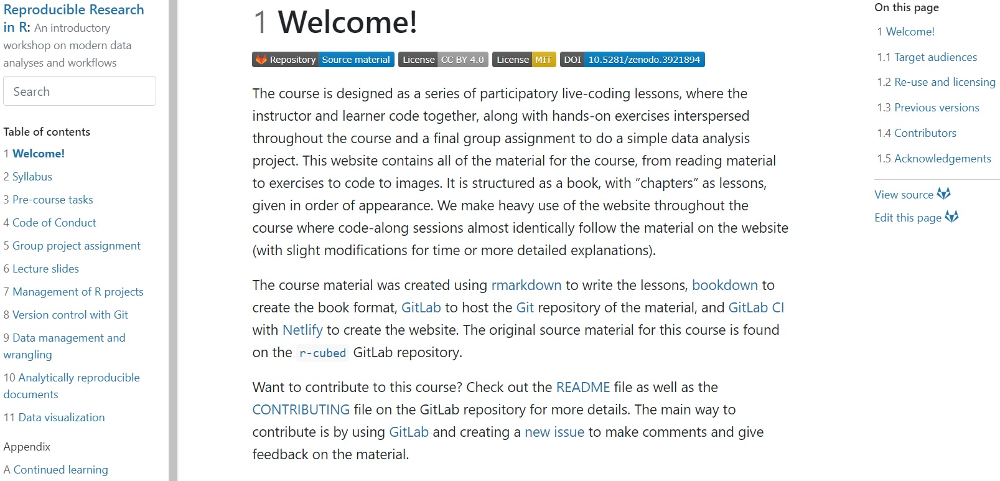
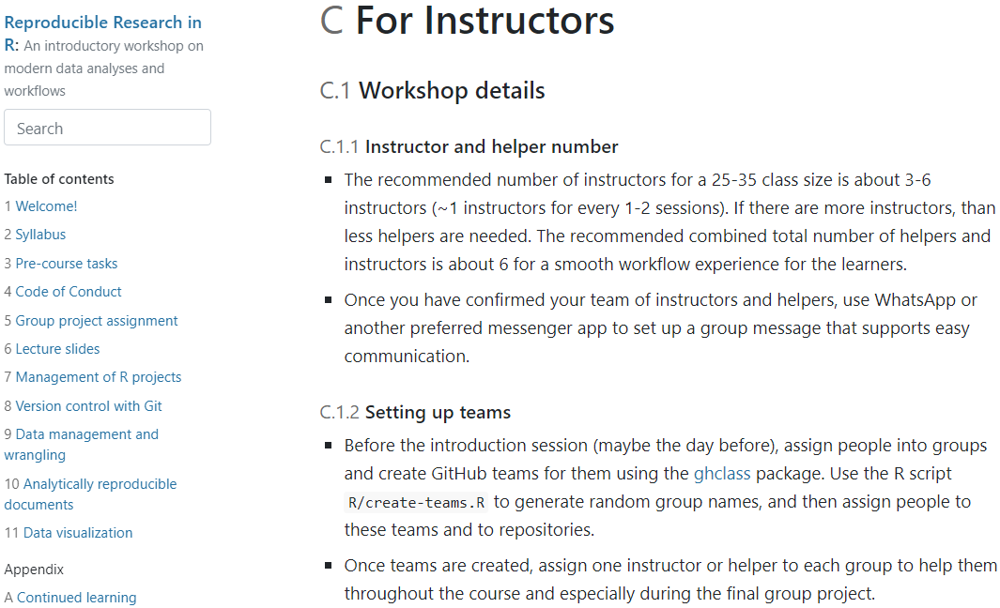

# Motivation

- ↑ Amount of biological data created each year

- ↑ Need for knowledge/skills to manage, process, and analyze data

- Training in modern computational skills has not kept pace, particularly in biomedical research

- Open Science movement: Expectation for methods/analysis to be more reproducible

- Limited awareness of, training in, and incentive to conduct, reproducible research

- **Need: An open educational resource designed to improve skills in R and reproducibility**

---

# Introducing... r-cubed!

.center[]

---

# What is r-cubed?

## .center[[r-cubed.rostools.org](https://r-cubed.rostools.org/)]

- Five sub-modules focused on R and reproducibility

- Three stand-alone lectures relating to collaboration and Open Science

- Designed for in-person settings

---

# Who is it designed for?

- Based on the needs of biomedical researchers

* **Instructors of the workshop:** Teaching reference

* **Others interested in teaching:** Modify to build own lessons

* **Learners:**

  + Reference before, during, and after the workshop
  
  + Reference for self-teaching

---

# How is it different from other similar resources?

- Emphasis on the reproducibility and general workflow

- Cohesion between sub-modules, with later sessions building on skills taught in earlier sessions

- Instructors are provided with comprehensive instructions for how to deliver material effectively in workshops (see [Appendix C](https://r-cubed.rostools.org/for-instructors.html))

---

# Instructions for Instructors

.center[]

---

# Content Covered

- **Management of R Projects**: RStudio, packages, data, file paths, troubleshooting

- **Version Control with Git**: Git & RStudio, Git & GitHub, collaborating with others, dealing with merge conflicts

- **Data Management and Wrangling**: Select, rename, filter, arrange, split-apply-combine functions

- **Analytically Reproducible Documents**: R Markdown

- **Data Visualization**: Plots

---

# Instructional Design

1. Participatory live-coding

2. Independent reading

3. Brief exercises

4. Group assignment

---

# Experience of Teaching r-cubed

- Delivered three times previously via a 3-4 day workshop

- Instructors: Recently learned R themselves

- Participants: Total beginners

- Recommended ratio: 1:4-6

- Pre- and post-workshop surveys

- Funded by:

.center[]

---

# Workshop Feedback

### Some Challenges

- Version control with Git was a steep learning curve

### Positive Experiences

- Easy to follow

- Good balance between code-alongs, exercises, and reading

- Noticeable skill improvements

---

class: center, middle

# Visit! Use! Share!

## [r-cubed.rostools.org/](https://r-cubed.rostools.org/)

---

class: center, middle

# Thanks! I can now take questions.